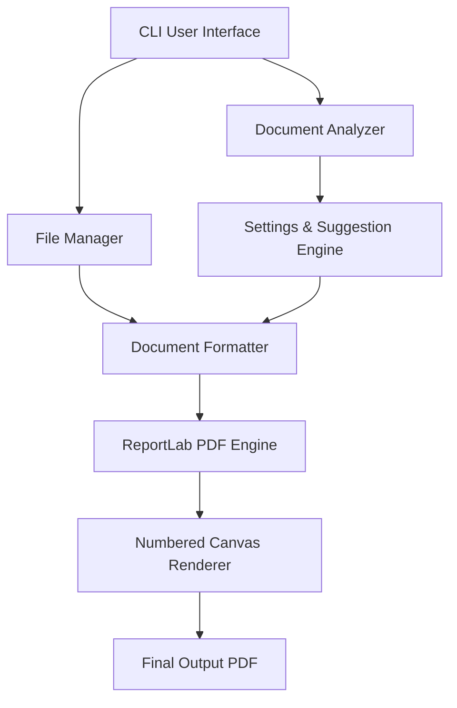

# Developer & Architecture Guide

Welcome to the **Mint PDF** architecture guide. This document provides an overview of the design principles, directory structures, and core rendering components of Mint PDF.

---

## Architecture Overview

Mint PDF is structured as a modular, lightweight Python package that transforms markdown, plaintext, and Word documents into professionally typeset PDFs completely offline.

### Core Components

1. **`main.py`**: The application bootstrap entry point. Handles setup detection, config restoration, and initializes the Rich-based interactive shell loop.
2. **`cli.py`**: Implements the terminal interactive UI, setup wizards, navigation state stacks, custom panels, and progress bars.
3. **`settings.py`**: Pydantic v2 schemas representing application configurations, layout parameters, margins, and case-insensitive enum validators.
4. **`document_analyzer.py`**: Parses input text files to score structures (heading counts, text lengths, table elements) and auto-suggests fitting themes and layouts.
5. **`formatter.py`**: Converts parsed markdown strings (lists, tables, blockquotes, code blocks) into ReportLab's `Flowable` objects.
6. **`pdf_engine.py`**: Compiles document flowables, prepends cover pages, inserts Table of Contents dot leaders, and coordinates the `NumberedCanvas` rendering passes.
7. **`theme_manager.py` & `template_manager.py`**: Maintain registry lists for the 10 built-in themes and 25 layouts, and handle loading custom JSON designs from project directories.

---

## Design Principles

### 1. 100% Offline Capability
Mint PDF does not make any network requests during document analysis, structure formatting, or PDF compilation. All font metrics, layout definitions, and parsers are packaged locally.

### 2. Auto-Recovery & Fault Tolerance
Configurations are automatically restored to default values if values are corrupted or invalid. Sub-dictionaries (such as custom margins) validate field-by-field, preserving correct values while resetting only invalid variables to defaults.

### 3. Separation of Layout and Styling
- **Themes** (`Theme` objects): Control color palettes (primary, secondary, accent, backgrounds, text, borders).
- **Templates** (`Template` objects): Control structural layout dimensions (margins, typography font sizes, leading heights, heading scales).
- **Fonts** (`FontManager`): Handles ReportLab TTF font metric registrations safely, falling back to standard system fonts to prevent rendering failures.
